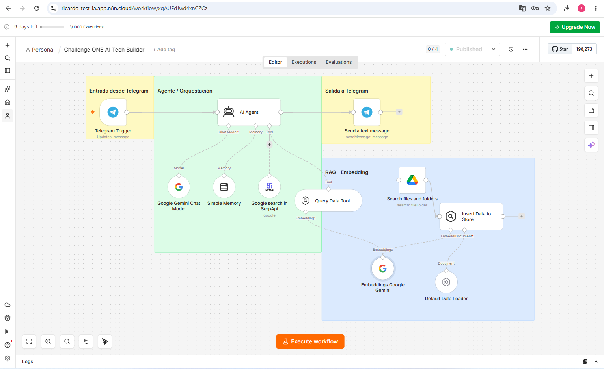
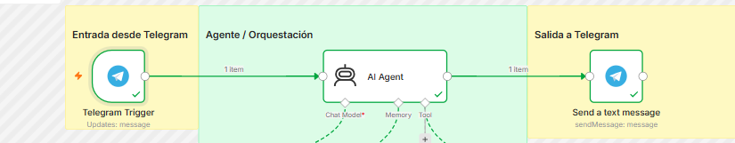
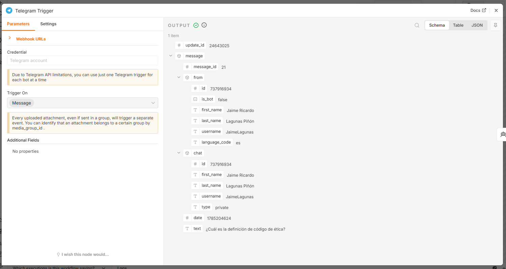
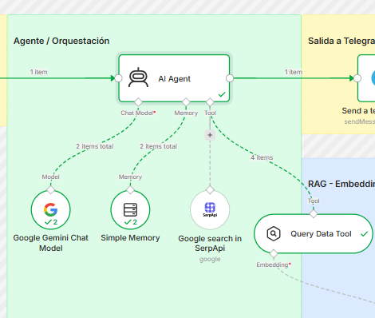
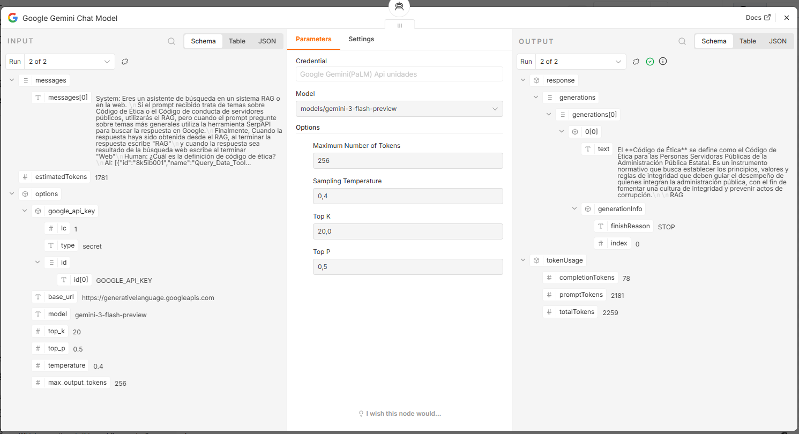
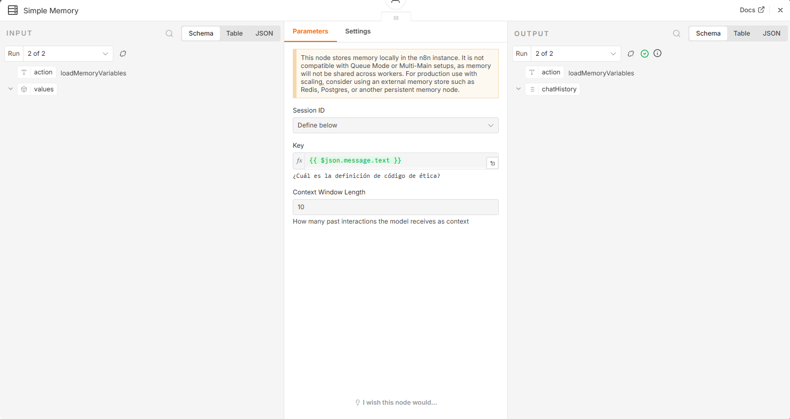
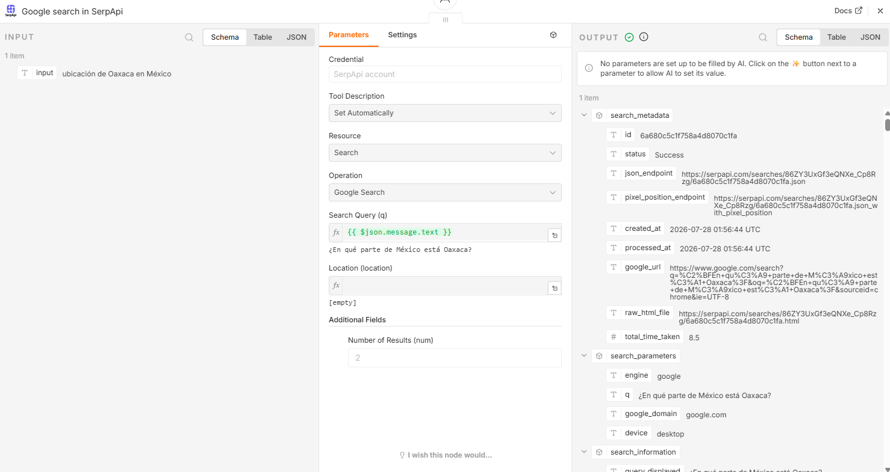
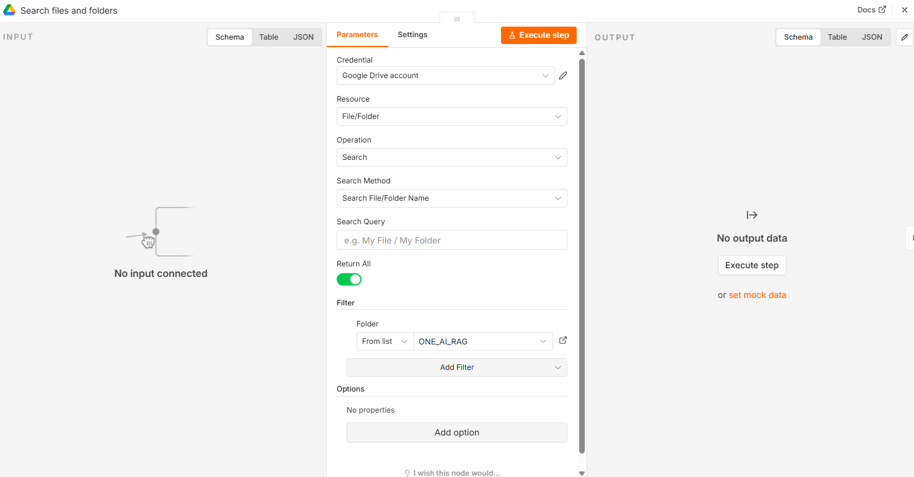
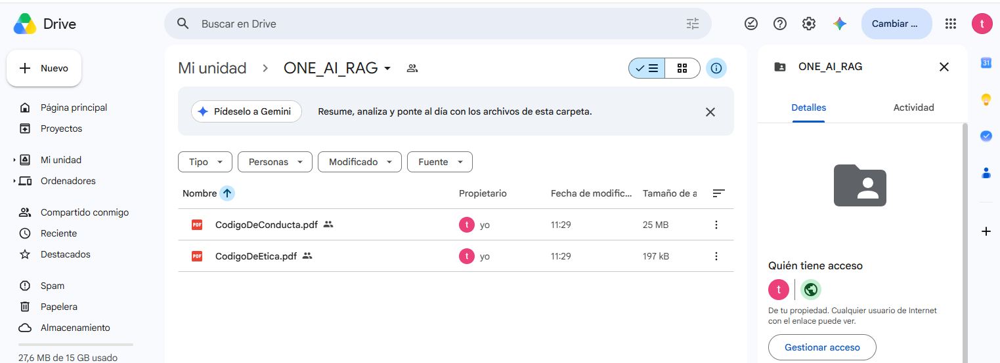

# 🏗️ Arquitectura del Flujo – Challenge ONE AI Tech Builder

Este documento describe la arquitectura del flujo de trabajo implementado en **n8n** para el desafío **Oracle Next Education (ONE) – AI Tech Builder**.  
El agente de IA fue diseñado para responder preguntas de colaboradores utilizando un sistema **RAG (Retrieval-Augmented Generation)** con documentos internos y, en caso de no encontrar la información, realizar búsquedas en la web mediante **SerpAPI**.

---

## 📸 Diagrama del Flujo

---

## 🔶 Entrada desde Telegram
- **Telegram Trigger**: recibe mensajes enviados por los usuarios.  

- El mensaje se convierte en el punto de inicio del flujo.

---

## 🟩 Agente / Orquestación
- **AI Agent**: núcleo del sistema.
  - Configurado con un **systemMessage** que define la lógica de decisión:  
    - Si la consulta trata sobre **Código de Ética** o **Código de Conducta de servidores públicos**, se usa el **RAG**.  
    - Para temas generales, se usa **SerpAPI**.  
    - Al final de cada respuesta se etiqueta con “RAG” o “Web” según la fuente.  
  - Iteraciones máximas: 5.  

- **Google Gemini Chat Model**:  
  - Modelo de lenguaje configurado con:  
    - `maxOutputTokens = 256`  
    - `temperature = 0.4`  
    - `topK = 20`  
    - `topP = 0.5`  
  - Estos parámetros optimizan el consumo de créditos y mantienen respuestas concisas.
  
  

- **Simple Memory**:  
  - Almacena contexto de la conversación con ventana de 10 interacciones.
 
  

- **Google search in SerpApi**:  
  - Herramienta para realizar búsquedas en Google cuando el RAG no contiene la información.  
  - Configurada para devolver hasta 2 resultados por consulta.  

  

---

## 🔵 Sistema RAG – Embedding
- **Google Drive (Search files and folders)**:  
  - Carpeta con documentos PDF que sirven como base de conocimiento.  
  - ID de carpeta: `ONE_AI_RAG`.  

- **Default Data Loader**:  
  - Carga documentos en formato binario.  

- **Embeddings Google Gemini**:  
  - Genera representaciones vectoriales de los documentos.  

- **Insert Data to Store**:  
  - Almacena embeddings en memoria vectorial (`vector_store_key`).  

- **Query Data Tool**:  
  - Recupera información relevante desde el vector store.  
  - Funciona como herramienta de consulta semántica para el agente.
 
      

      
---

## 🟨 Salida a Telegram
- **Send a text message**:  
  - Envía la respuesta generada por el agente al usuario en Telegram.  
  - Formato de salida en HTML para mejor presentación.  

---

## ⚙️ Flujo General
1. El usuario envía una consulta por Telegram.  
2. El **AI Agent** interpreta la solicitud.  
3. Si corresponde a temas de ética/código de conducta → consulta en el **RAG**.  
4. Si es un tema general → consulta en **SerpAPI**.  
5. El resultado se envía de vuelta al usuario en Telegram con la etiqueta “RAG” o “Web”.  

---

## ✅ Beneficios del Diseño
- **Automatización completa**: desde la entrada del mensaje hasta la respuesta.  
- **Optimización de créditos**: parámetros ajustados en Gemini para eficiencia.  
- **Flexibilidad**: integración de RAG y búsqueda web.  
- **Escalabilidad**: preparado para despliegue en **Oracle Cloud Infrastructure (OCI)**.  

---

## 📌 Evidencias
- Captura del flujo en n8n (arriba).  
- Ejemplo de interacción en Telegram.  
- Video demostrativo del despliegue en OCI.  
